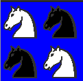

<div>
<table width="1000px">
    <theader>
        <tr>
            <td></td>
            <th>
                <span style="font-weight:bold;">UNIVERSIDAD NACIONAL DE SAN AGUSTIN</span><br />
                <span style="font-weight:bold;">FACULTAD DE INGENIERÍA DE PRODUCCIÓN Y SERVICIOS</span><br />
                <span style="font-weight:bold;">DEPARTAMENTO ACADÉMICO DE INGENIERÍA DE SISTEMAS E INFORMÁTICA</span><br />
                <span style="font-weight:bold;">ESCUELA PROFESIONAL DE INGENIERÍA DE SISTEMAS</span>
            </th>
            <td></td>
        </tr>
    </theader>
    <tbody>
        <tr><td colspan="3"><span style="font-weight:bold;">Formato</span>: Guía de Práctica de Laboratorio</td></tr>
        <tr><td><span style="font-weight:bold;">Aprobación</span>:  2022/03/01</td><td><span style="font-weight:bold;">Código</span>: GUIA-PRLD-001</td><td><span style="font-weight:bold;">Página</span>: 1</td></tr>
    </tbody>
</table>
</div>

<div align="center">
    <span style="font-weight:bold;">INFORME DE LABORATORIO</span><br />
</div>

<div align="center">
    <table width="1000px">
        <theader>
            <tr><th colspan="6">INFORMACIÓN BÁSICA</th></tr>
        </theader>
        <tbody>
            <tr><td>ASIGNATURA:</td><td colspan="5">Programación Web 02</td></tr>
            <tr><td>TÍTULO DE LA PRÁCTICA:</td><td colspan="5">Pyhton</td></tr>
            <tr><td>NÚMERO DE PRÁCTICA:</td><td>04</td><td>AÑO LECTIVO:</td><td>2023 A</td><td>NRO. SEMESTRE:</td><td width="60px">  III  </td></tr>
            <tr><td>FECHA DE PRESENTACIÓN:</td><td>5-Junio-2023</td><td>HORA DE PRESENTACIÓN:</td><td colspan="3">11:00</td></tr>
            <tr>
              <td colspan="4">NOMBRE:
                <ul>
            	    <li>Añazco Huamanquispe, Andre Renzo</li>
                </ul>
              </td>
              <td>NOTA:</td><td></td>
            </tr>
            <tr>
              <td colspan="6" width="1000px">DOCENTES:
                <ul>
        	        <li>Anibal Sardon Paniagua</li>
                </ul>
              </td>
            </tr>
        </tbody>
    </table>
</div>

# Python

[![License][license]][license-file]
[![Downloads][downloads]][releases]
[![Last Commit][last-commit]][releases]

[![Debian][Debian]][debian-site]
[![Git][Git]][git-site]
[![GitHub][GitHub]][github-site]
[![Vim][Vim]][vim-site]
[![Java][Java]][java-site]

#

## OBJETIVOS TEMAS Y COMPETENCIAS

### OBJETIVOS

-   Programar usando Python.
-   Mostrar un ejemplo de separación de intereses en clases: el modelo (lista de strings) de su vista (dibujo de gráficos).

### TEMAS
-   Listas
-   Ciclos
-   Programación orientada a objetos
-   ¿Programación funcional?

<details>
<summary>COMPETENCIAS</summary>

- C.c Diseña responsablemente sistemas, componentes o procesos para satisfacer necesidades dentro de restricciones realistas: económicas, medio ambientales, sociales, políticas, éticas, de salud, de seguridad, manufacturación y sostenibilidad.
- C.m Construye responsablemente soluciones siguiendo un proceso adecuado llevando a cabo las pruebas ajustada a los recursos disponibles del cliente.
- C.p Aplica de forma flexible técnicas, métodos, principios, normas, estándares y herramientas de ingeniería necesarias para la construcción de software e implementación de sistemas de información.

</details>

## CONTENIDO DE LA GUÍA

### MARCO CONCEPTUAL

-   https://www.w3schools.com/python/python_reference.asp
-   https://docs.python.org/3/tutorial/

-   Virtual Environment
    -   La reutilización de código(paquetes, librerias, plugins, etc.) de terceros nos permite construir software más complejo. 
    -   NodeJS usa paquetes instalados en el directorio de trabajo y no de manera global, registrando estos paquetes en sus versiones en el archivo package.json. 
    -   Por eso este modo de trabajo nos permite tener distintos proyectos con distintas bibliotecas, de distintas versiones, en la misma máquina, sin que existan conflictos. 
    -   Para compartir el proyecto se debe compartir el archivo package.json y luego llamar a "npm install" para instalar las bibliotecas adecuadas para el proyecto.
    -   Java usa ant y maven, junto con archivos xml para realizar estas tareas.
    -   Python tiene virtualenv, para crear este espacio de trabajo.
    -   Python utiliza el manejador de paquetes pip.

-   Utilizar Python
    -   Para un instalación local en sistemas operativos MS Windows utilice: https://www.python.org/downloads/windows/
    -   Tambien ud puede probar código en herramientas online: https://www.programiz.com/python-programming/online-compiler/

    -   Python en Debian GNU/Linux:
        -   Debian Linux viene con Python 3 y Python 2 preinstalados.
            ```sh
            python3 --version
            Python 3.9.2
            ```
        -   Instalemos pip, una herramienta que instalará y administrará los paquetes de programación que queramos usar en nuestros proyectos de desarrollo. 
            ```sh
            sudo apt-get install -y python3-pip
            ```
        -   Paquetes y herramientas de desarrollo más para instalar para garantizar que tengamos una configuración sólida para nuestro entorno de programación:
            ```sh
            sudo apt-get install build-essential libssl-dev libffi-dev python3-dev
            ```
    -   Configurar un entorno virtual:
        - Los entornos virtuales permiten tener un espacio aislado en los proyectos Python
        -   Garantizando que cada proyecto pueda tener su propio conjunto de dependencias que no interrumpirán a otros proyectos.
        -   Manejando diferentes versiones de los paquetes. Esto es especialmente importante cuando se trabaja con paquetes de terceros.
        -   Puede varios entornos de programación. 
        -   Cada entorno es un directorio en la que se ubicaran sus scripts.
        -   Usaremos el módulo venv , que es parte de la biblioteca estándar de Python.
        -   Instalemos venv escribiendo:
            ```sh
            sudo apt install -y python3-venv
            ```
        -   Para crear un ambiente elija en qué directorio.
            ```sh
            mkdir -p ~/unsa/pw2/labs/lab04/my_env
            cd ~/unsa/pw2/labs/lab04/my_env
            ```
        -   En el directorio crea un entorno virtual ejecutando el siguiente comando:
            ```sh
            virtualenv -p python3 .
            mkdir -p ~/unsa/pw2/labs/lab04/my_env/src
            cd ~/unsa/pw2/labs/lab04/my_env/src
            ```
        -   Esto es lo que sucedio:
            ```sh
            tree -L 2 ../
            ```
            ```sh
            .
            ├── bin
            │   ├── activate
            │   ├── activate.csh
            │   ├── activate.fish
            │   ├── activate.nu
            │   ├── activate.ps1
            │   ├── activate_this.py
            │   ├── deactivate.nu
            │   ├── pip
            │   ├── pip3
            │   ├── pip-3.9
            │   ├── pip3.9
            │   ├── python -> /usr/bin/python3
            │   ├── python3 -> python
            │   ├── python3.9 -> python
            │   ├── wheel
            │   ├── wheel3
            │   ├── wheel-3.9
            │   └── wheel3.9
            ├── lib
            │   └── python3.9
            ├── pyvenv.cfg
            └── src
            ```
        -   Ejecute el script de activación para activar el entorno virtual:
            ```sh
            source ../bin/activate
            ```
            ```sh
            (my_env) user@localhost:$
            ```

        -   Cree el "Hola Mundo" en su entorno de programación:
            ```sh
            vim hello.py
            ```
            ```sh
            print("Hello, World!")
            ```
            ```sh
            python3 hello.py
            ```
        -   Para salir del entorno virtual:
            ```sh
            deactivate
            ```

## EJERCICIO RESUELTO POR EL DOCENTE

-   Active su entorno virtual
    ```sh
    source ../bin/activate
    ```
-   Ejercicios sobre matrices de tamaño NxN:

    -   Determine si una matriz es escalar:
        ```sh
        vim esEscalar.py
        ```
        ```sh
        def esEscalar(m):
            d = m[0][0]
            for i in range(len(m)):
                for j in range(len(m)):
                    if i != j:
                        if m[i][j] != 0:
                            print(m[i][j])
                            return False
                    elif m[i][j] != d:
                        print(m[i][j])
                        return False
            return True
        ```
        ```sh
        vim test_esEscalar.py
        ```
        ```sh
        import esEscalar as fu

        def prueba(M):
            if (fu.esEscalar(M)):
                print("Si es escalar")
            else:
                print("No es escalar")

        #Z = [[1, 2, 3], [4, 5, 6], [7, 8, 9]]
        #Z = [[1, 2, 3], [4, 1, 6], [7, 8, 1]]
        Z = [[1, 0, 0], [0, 1, 0], [0, 0, 1]]

        prueba(Z)
        ```

    -   Determine si una matriz es unitaria:
         ```sh
        vim esUnitaria.py
        ```
        ```sh
        import esEscalar as fu

        def esUnitaria(m):
            return m[0][0] == 1 and fu.esEscalar(m)
        ```
        ```sh
        vim test_esUnitaria.py
        ```
        ```sh
        import esUnitaria as fu

        def prueba(M):
            if (fu.esUnitaria(M)):
                print("Si es unitaria")
            else:
                print("No es unitaria")

        #Z = [[1, 2, 3], [4, 5, 6], [7, 8, 9]]
        #Z = [[1, 2, 3], [4, 1, 6], [7, 8, 1]]
        Z = [[2, 0, 0], [0, 2, 0], [0, 0, 2]]
        #Z = [[1, 0, 0], [0, 1, 0], [0, 0, 1]]

        prueba(Z)
        ```

#

## EJERCICIOS PROPUESTOS
-   En esta tarea usted pondrá en práctica sus conocimientos de programación en Python para dibujar un tablero de Ajedrez. 
-   La parte gráfica ya está programada, usted sólo tendrá que concentrarse en las estructuras de datos subyacentes.
-   Con el código proporcionado usted dispondrá de varios objetos de tipo Picture para poder realizar su tarea:
    
-   Estos objetos estarán disponibles importando la biblioteca: [chessPictures](Tarea-del-Ajedrez/chessPictures.py) y estarán internamente representados con arreglos de strings que podrá revisar en el archivo [pieces.py](Tarea-del-Ajedrez/pieces.py)
-   La clase [Picture](Tarea-del-Ajedrez/picture.py) tiene un sólo atributo: el arreglo de strings img, el cual contendrá la representación en caracteres de la figura que se desea dibujar. 
-   La clase [Picture](Tarea-del-Ajedrez/picture.py) ya cuenta con una función implementada, no debe modificarla, pero si puede usarla para implementar sus otras funciones:
    -   _invColor: recibe un color como un caracter de texto y devuelve su color negativo, también como texto, deberá revisar el archivo [colors.py](Tarea-del-Ajedrez/colors.py) para conocer los valores negativos de cada caracter.

-   La clase [Picture](Tarea-del-Ajedrez/picture.py) contará además con varios métodos que usted deberá implementar:
    1.  verticalMirror: Devuelve el espejo vertical de la imagen
    2.  horizontalMirror: Devuelve el espejo horizontal de la imagen
    3.  negative: Devuelve un negativo de la imagen
    4.  join: Devuelve una nueva figura poniendo la figura del argumento al lado derecho de la figura actual
    5.  up: Devuelve una nueva figura poniendo la figura recibida como argumento, encima de la figura actual
    6.  under: Devuelve una nueva figura poniendo la figura recibida como argumento, sobre la figura actual
    7.  horizontalRepeat, Devuelve una nueva figura repitiendo la figura actual al costado la cantidad de veces que indique el valor de n
    8.  verticalRepeat Devuelve una nueva figura repitiendo la figura actual debajo, la cantidad de veces que indique el valor de n

-   Tenga en cuenta que para implementar todos estos métodos, sólo deberá trabajar sobre la representación interna de un Picture, es decir su atributo img.

-   Para dibujar una objeto Picture bastará importar el método draw de la biblioteca interpreter y usarlo de la siguiente manera:
    ```sh
    $ python3
    Python 3.9.2 (default, Feb 28 2021, 17:03:44) 
    [GCC 10.2.1 20210110] on linux
    Type "help", "copyright", "credits" or "license" for more information.
    ```
    ```sh
    >>> from chessPictures import *
    >>> from interpreter import draw
    pygame 1.9.6
    Hello from the pygame community. https://www.pygame.org/contribute.html
    >>> draw(rock)
    ```
    

-   Ejercicios:

    -   Para resolver los siguientes ejercicios sólo está permitido usar ciclos, condicionales, definición de listas por comprensión, sublistas, map, join, (+), lambda, zip, append, pop, range.

        1.  Implemente los métodos de la clase Picture. Se recomienda que implemente la clase picture por etapas, probando realizar los dibujos que se muestran en la siguiente preguntas.
        2.  Usando únicamente los métodos de los objetos de la clase Picture dibuje las siguientes figuras (invoque a draw):

            *    (a) 
            
            - Programa Principal
            ```python
            from interpreter import draw
            from chessPictures import *

            line1 = knight.join(knight.negative())
            line2 = knight.negative().join(knight)

            img = line1.up(line2)
            draw(img)
            ```
            

            *    (b) 
            
            ```py
            from interpreter import draw
            from chessPictures import *

            line1 = knight.join(knight.negative())
            line2 = knight.join(knight.negative())
            line2 = line2.horizontalMirror()

            img = line1.up(line2)
            draw(img)
            ```
            

            
            *    (c) 
            
            ```python
            from interpreter import draw
            from chessPictures import *

            line1 = queen.horizontalRepeat(4)

            draw(line1)
            ```
            

            *    (d) 
            
            ```python
            from interpreter import draw
            from chessPictures import *


            image = square

            for i in range(7):
                if (i%2 ==0):
                    image = image.join(square.negative())
                else:
                    image = image.join(square)

            draw(image)
            ```
            
            

            *    (e) 
            
            ```python
            from interpreter import draw
            from chessPictures import *


            image = square

            for i in range(7):
                if (i%2 ==0):
                    image = image.join(square.negative())
                else:
                    image = image.join(square)

            draw(image.horizontalMirror())
            ```

            *    (f) 
            
            ```python
            from interpreter import draw
            from chessPictures import *


            image = square
            for i in range(7):
                if (i%2 ==0):
                    image = image.join(square.negative())
                else:
                    image = image.join(square)


            line = square 
            for i in range(7):
                if (i%2 ==0):
                    line = line.join(square.negative())
                else:
                    line = line.join(square)

            for a in range(3):
                if (a%2 ==0):
                    image = image.up(line.horizontalMirror())
                else:
                    image = image.up(line)
            draw(image)

            ```
            

            *    (g) 
            
            ```python
            from interpreter import draw
            from chessPictures import *


            #fichas negras 
            image = rock.negative()
            image = image.setBackground(square)

            pieces = [knight, bishop,queen,king,bishop,knight,rock]

            print(len(pieces))

            for i in range(len(pieces)):
                line = pieces[i]     
                line = line.negative()
                if (i%2 ==0):
                    line = line.setBackground(square.negative())
                else:
                    line = line.setBackground(square)
                image = image.join(line)

            line = pawn.negative()
            line = line.setBackground(square.negative())
            for i in range(7):
                lineaux = pawn.negative()
                if (i%2 ==1):
                    lineaux = lineaux.setBackground(square.negative())
                else:
                    lineaux = lineaux.setBackground(square)
                line = line.join(lineaux)
            image.up(line)

            #casillas vacias
            line = square.negative()
            for i in range(7):
                if (i%2 ==1):
                    line = line.join(square.negative())
                else:
                    line = line.join(square)


            for a in range(4):
                if (a%2 ==0):
                    image = image.up(line.horizontalMirror())
                else:
                    image = image.up(line)

            #fichas blancas
            line = pawn
            line = line.setBackground(square)
            for i in range(7):
                lineaux = pawn
                if (i%2 ==0):
                    lineaux = lineaux.setBackground(square.negative())
                else:
                    lineaux = lineaux.setBackground(square)
                line = line.join(lineaux)
            image.up(line)


            line =  rock
            line = line.setBackground(square.negative()) 
            for i in range(len(pieces)):
                lineaux = pieces[i]     
                if (i%2 ==1):
                    lineaux = lineaux.setBackground(square.negative())
                else:
                    lineaux = lineaux.setBackground(square)
                line = line.join(lineaux)

            image.up(line)

            draw(image)

            ```
            <br> 

#

## CUESTIONARIO
-   ¿Qué son los archivos *.pyc?

-   Los archivos .pyc son el resultado de la traduccion de un programa escrito en python a bytecode,  estos archivos son importantes pues se pueden implementar en otros programas escritos en Pyhton

-   ¿Para qué sirve el directorio __pycache__?
-   El directorio __pycache__ , es el encargado de almacenar los archivos .pyc, las traducciones del codigo fuente a bytecode, esto se usa para mejorar los tiempos de ejecucion, pues python se encarga de gestionar los archivos cache para no tener que crear unos desde 0.

-   ¿Cuáles son los usos y lo que representa el subguión en Python?
-   El subguion, puede ser usado como variable, asi como ser utilizado para ignorar valores, o tambien para mejorar la legibilidad separando valores numericos
#

## REFERENCIAS
-   https://www.w3schools.com/python/python_reference.asp
-   https://docs.python.org/3/tutorial/

#

[license]: https://img.shields.io/github/license/rescobedoq/pw2?label=rescobedoq
[license-file]: https://github.com/rescobedoq/pw2/blob/main/LICENSE

[downloads]: https://img.shields.io/github/downloads/rescobedoq/pw2/total?label=Downloads
[releases]: https://github.com/rescobedoq/pw2/releases/

[last-commit]: https://img.shields.io/github/last-commit/rescobedoq/pw2?label=Last%20Commit

[Debian]: https://img.shields.io/badge/Debian-D70A53?style=for-the-badge&logo=debian&logoColor=white
[debian-site]: https://www.debian.org/index.es.html

[Git]: https://img.shields.io/badge/git-%23F05033.svg?style=for-the-badge&logo=git&logoColor=white
[git-site]: https://git-scm.com/

[GitHub]: https://img.shields.io/badge/github-%23121011.svg?style=for-the-badge&logo=github&logoColor=white
[github-site]: https://github.com/

[Vim]: https://img.shields.io/badge/VIM-%2311AB00.svg?style=for-the-badge&logo=vim&logoColor=white
[vim-site]: https://www.vim.org/

[Java]: https://img.shields.io/badge/java-%23ED8B00.svg?style=for-the-badge&logo=java&logoColor=white
[java-site]: https://docs.oracle.com/javase/tutorial/


[![Debian][Debian]][debian-site]
[![Git][Git]][git-site]
[![GitHub][GitHub]][github-site]
[![Vim][Vim]][vim-site]
[![Java][Java]][java-site]


[![License][license]][license-file]
[![Downloads][downloads]][releases]
[![Last Commit][last-commit]][releases]